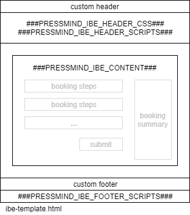
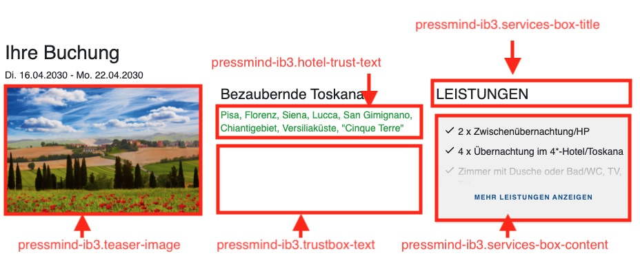
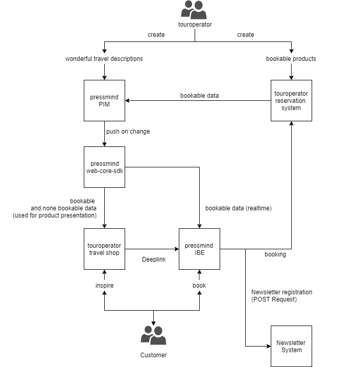

# pressmind® IB3 Integration Kit
## Building a hyperlink to book via the IBE

To build a link you need to provide the following get parameters:

* ``imo`` (id of media object) REQUIRED
* ``idd``(id of travelling date) REQUIRED
* ``iho[]=1`` (array of ids for housing options with quantifier) or ido (id of option (housing option, ticket, sightseeing, extra; depending on the price mix of the booking package)) OPTIONAL
* ``idbp`` (id of booking package) REQUIRED IF iho or ido is set
* ``idhp`` (id of housing package) REQUIRED IF iho or ido is set
* ``ida`` (agency id) OPTIONAL (Kuschick CRS only! If given the agency id will be submitted in the requests to Kuschick CRS)
* ``dc`` (discount code) OPTIONAL (if given, the discount code will be checked right before the checkout and the discount will automatically be added to the booking, if applicable, eg. configured in the backend) THIS WILL WORK ONLY FOR THE pressmind® IBE. For Kuschick bookings the Code has to be set in the Kuschick administration.
* ``rt`` (return url) OPTIONAL (BASE64 encoded URL of the original detail page, if set, will be use for a link to return to the detail page)
* ``t`` (booking type) OPTIONAL possible values request|option|fix

EXAMPLES:  
https://my_company.pressmind-ibe.net/?imo=1234&idbp=5678&idd=9876&idhp=4321&iho[123]=1&iho[456]=2  
Will load the checkout page for the media object 1234 and display 2 housing options (e.g. rooms) one of id 123 and two of id 456 which belong to the date with id 9876.

https://my_company.pressmind-ibe.net/?imo=1234&idbp=5678&idd=9876&idhp=4321&ido=123  
Will load the checkout page for the media object 1234 and display the option set in ido

https://my_company.pressmind-ibe.net/?imo=1234&idd=9876  
Will load the checkout page for the media object 1234 and additionally display a step in which the desired housing option can be chosen by the user  

https://my_company.pressmind-ibe.net/?imo=1234&idbp=5678&idd=9876&idhp=4321&ido=123&dc=EARLYBIRD12345  
Will load the checkout page for the media object 1234 and display the option set in ido, in the last step the promotion code EARLYBIRD12345 will be discounted to the booking, if applicable. 

## Header and Footer Template Integration
To integrate a custom header and footer resource into the IBE layout, a public accessible html file with the desired contents must be available. 
This file has to contain the following Placeholder for the IBE to be injected:

```php
###PRESSMIND_IBE_HEADER_CSS###
###PRESSMIND_IBE_HEADER_SCRIPTS###
###PRESSMIND_IBE_CONTENT###
###PRESSMIND_IBE_FOOTER_SCRIPTS###
```

In the example_files folder in this repo you can find the file layout_example.html to use it as a starting point for your custom integration file. 



### Please make sure that all images and included stylesheets/javascript resources in your custom layout are delivered via https and that an Access-Control-Allow-Origin header is sent for these resources.

## Newsletter integration
To enable pressmind® IB3 to automatically register to a newsletter service like CleverReach or maileon or a custom implementation you need to place a script on your server that will handle a POST request send by pressmind® IB3.
The POST request will contain the following POST Parameters (multipart/form-data): 

* email => email address of the customer
* title => title of the customer
* first_name => first name of the customer
* last_name => last name of the customer
* nationality => nationality of the customer (ISO 2-letter code)
* gender => gender of the customer (M/F)
* api_key => the API key that has been stored in the pressmind® IB3 administrators backend

The called script has to return/echo the following JSON:
```json
{
    "success": true/false,
    "message": "String with message in case of success or failure"
}
```

Feel free to download the "newsletter_testscript.php" file from "example_files" to have a test and starting point for your integration.

## Set Header Contents with pressmind® tags
To set the contents of the Header, you need to set the following tags to the according pressmind® data fields as shown in the image below:  
* pressmind-ib3.teaser-image
* pressmind-ib3.hotel-trust-text
* pressmind-ib3.trustbox-text
* pressmind-ib3.services-box-title
* pressmind-ib3.services-box-content




## Integration Workflow

