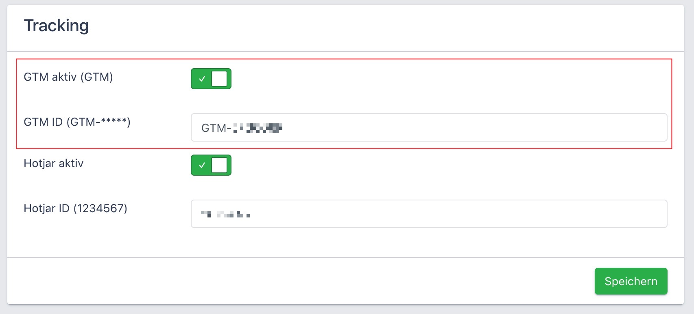

# GTM Datalayer

## 1. Activate GTM
Go to "IB3 Backend/Sonstige/Tracking" and activate GTM and enter the GTM-ID.



## 2. Layers & Events
The pressmind® IB3 pushes the following datalayers:

| event | description |
| --- | ---- |
|ib3.entry | fired on ib3 entry pageload completed)|
|ib3.booked| fired if the booking is done|
|ib3.bookedFailure| booking process can not be completed (technical error)|

### Example Payload
```js
{
  event: "ib3.booked",
  ecommerce: {
    page_type: "basket",
    order_id: "12345",
    items: [
      {
        id: 1264338,
        name: "Mit dem Glacier-Express nach Zermatt",
        destination: "Italien",
        travel_type: "Rundreisen",
        price: 1098
      }
    ]
  }
}
```


